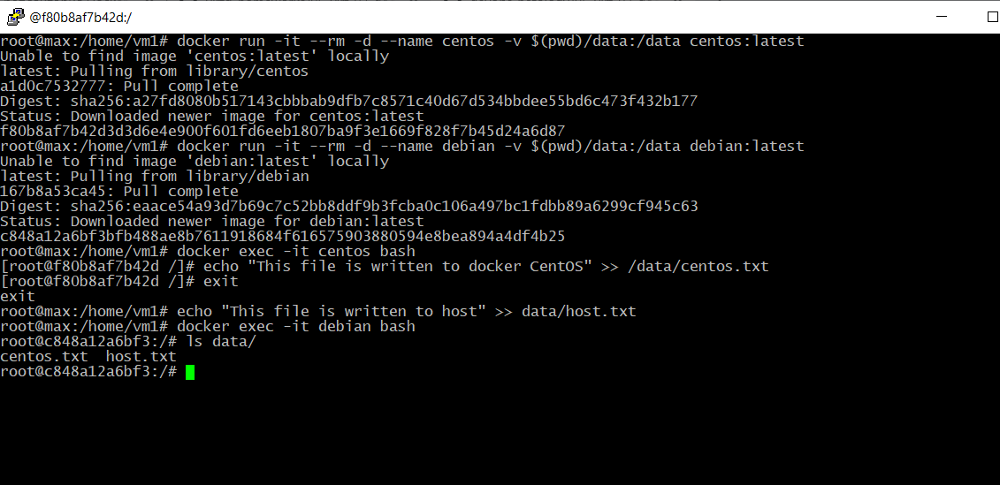

# `Домашнее задание к занятию "5.3. Введение. Экосистема. Архитектура. Жизненный цикл Docker контейнера" - Зозуля Максим`

## Задача 1

Сценарий выполения задачи:

- создайте свой репозиторий на https://hub.docker.com;
- выберете любой образ, который содержит веб-сервер Nginx;
- создайте свой fork образа;
- реализуйте функциональность:
запуск веб-сервера в фоне с индекс-страницей, содержащей HTML-код ниже:
```
<html>
<head>
Hey, Netology
</head>
<body>
<h1>I’m DevOps Engineer!</h1>
</body>
</html>
```
Опубликуйте созданный форк в своем репозитории и предоставьте ответ в виде ссылки на https://hub.docker.com/username_repo.

### Ответ


[https://hub.docker.com/r/shtitz1985/my_nginx](https://hub.docker.com/r/shtitz1985/my_nginx)

## Задача 2

Посмотрите на сценарий ниже и ответьте на вопрос:
"Подходит ли в этом сценарии использование Docker контейнеров или лучше подойдет виртуальная машина, физическая машина? Может быть возможны разные варианты?"

Детально опишите и обоснуйте свой выбор.

--

Сценарий:


- Высоконагруженное монолитное java веб-приложение;
```
Физический сервер или VM предпочтительнее, т.к. монолитное и на микросервисы сложно разбить. К тому же высоконагруженное - 
необходим прямой доступ к ресурсам.
```
- Nodejs веб-приложение;
```
Подойдет Docker, так как это веб-платформа с подключаемыми внешними библиотеками
```
- Мобильное приложение c версиями для Android и iOS;
```
Необходим GUI, так что подойдет виртуалка.
```
- Шина данных на базе Apache Kafka;
```
Если среда рабочая и полнота данных критична, то лучше использовать VM; если среда тестовая и потеря данных некритична,
можно использовать Docker.
```
- Elasticsearch кластер для реализации логирования продуктивного веб-приложения - три ноды elasticsearch, два logstash и
две ноды kibana;
```
Elasticsearvh лучше на VM, отказоустойчивость решается на уровне кластера, kibana и logstash можно вынести в Docker.
```
- Мониторинг-стек на базе Prometheus и Grafana;
```
Подойдет Docker, так как данные не хранятся, и масштабировать легко.
```
- MongoDB, как основное хранилище данных для java-приложения;
```
Зависит от нагрузки на DB. Если нагрузка большая, то физический сервер, если нет – VM.
```
- Gitlab сервер для реализации CI/CD процессов и приватный (закрытый) Docker Registry.
```
Подойдет VM для DB и фалового хранилища, Docker для сервисов
```


## Задача 3

- Запустите первый контейнер из образа ***centos*** c любым тэгом в фоновом режиме, подключив папку ```/data``` из текущей рабочей директории на хостовой машине в ```/data``` контейнера;
- Запустите второй контейнер из образа ***debian*** в фоновом режиме, подключив папку ```/data``` из текущей рабочей директории на хостовой машине в ```/data``` контейнера;
- Подключитесь к первому контейнеру с помощью ```docker exec``` и создайте текстовый файл любого содержания в ```/data```;
- Добавьте еще один файл в папку ```/data``` на хостовой машине;
- Подключитесь во второй контейнер и отобразите листинг и содержание файлов в ```/data``` контейнера.

### Ответ



